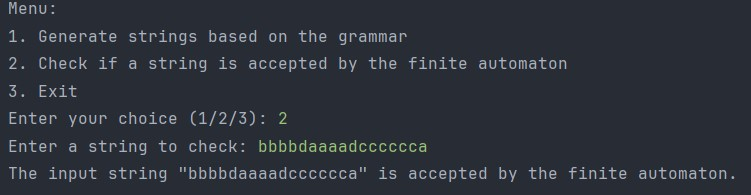
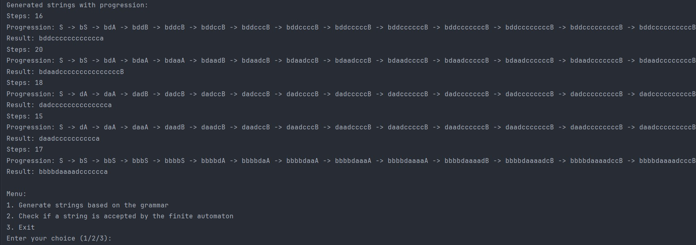

``# Context-Free Grammar and Finite Automaton Project Report

## Introduction

This project report outlines the comprehensive journey undertaken to explore and understand the concept of formal languages and their representation through context-free grammars (CFGs) and finite automata. The primary objectives of this venture include:

- Discovering the essence of what constitutes a language and the criteria that qualify it as a formal language.
- Establishing a foundational project setup that will evolve over the semester, treating laboratory works as incremental stages towards a significant, cohesive solution.

## Objectives

1. **Understanding Formal Languages:** To delve into the characteristics that define a language as formal, exploring its syntax, semantics, and the rules that govern its structure.
2. **Project Initialization:**
   a. **Repository Creation:** A GitHub repository was established to facilitate the versioning and sharing of project artifacts.
   b. **Programming Language Selection:** Java was chosen for its robust standard libraries, object-oriented capabilities, and widespread use in academic and industrial environments, which simplifies the focus on problem-solving rather than environmental setup.
   c. **Report Organization:** Reports are meticulously organized within the repository to streamline the verification process and ensure clarity and accessibility of documentation.

## Theory

A formal language is a set of strings of symbols that are precisely defined by specific syntactical and grammatical rules. For a language to be considered formal, it must have a well-defined alphabet and a grammar that dictates how symbols from the alphabet can be combined to form valid strings or sentences. Context-free grammars (CFGs) play a pivotal role in the study of formal languages, particularly in computer science and linguistics, by providing a framework to describe the syntax of programming languages and natural languages alike.

## CFG Definition

- **Non-terminals (VN):** {S, A, B}
- **Terminals (VT):** {a, b, c, d}
- **Productions (P):**
    - S → bS | dA
    - A → aA | dB | b
    - B → cB | a

## Implementation Overview

### Grammar Class

The Grammar class is designed to encapsulate the CFG, facilitating the generation of strings in accordance with the grammar's production rules. Additionally, it offers functionality to convert the CFG into a finite automaton, thereby bridging the gap between theoretical grammar constructs and practical automaton-based string validation.

#### Key Features

- **String Generation:** Methods within this class are capable of generating strings that comply with the specified grammar rules. This includes a specialized method for illustrating the step-by-step progression of string generation, highlighting the replacement of non-terminal symbols.
- **Finite Automaton Conversion:** This feature converts the CFG into a finite automaton, establishing a direct correlation between non-terminals and automaton states, as well as between productions and state transitions.

```java
public class Grammar {
    private final List<Character> Vn;
    private final List<Character> Vt;
    private final Map<Character, List<String>> productions;
    private final Map<Character, List<String>> productionsTerminals;
    private final char S;

    public Grammar() {
        // Constructor initializes VN, VT, productions, and productionsTerminals
    }

    // Methods: generateString, generateStringWithProgression, toFiniteAutomaton
}
```

### FiniteAutomaton Class

This class represents the finite automaton, complete with mechanisms for adding states, defining transitions, and evaluating the acceptance of input strings based on the automaton's configuration.

```java
public class FiniteAutomaton {
    // Fields for states, alphabet (sigma), transitions, start state, and accept states

    // Constructor, setters, and methods to add states/transitions
    public boolean isStringAccepted(String input) {
        // Implementation
    }
}

```
### Main Class

A user-friendly interface is provided to facilitate interaction with the grammar and finite automaton functionalities. Users can generate strings based on the grammar or check the acceptance of specific strings by the finite automaton.
Validate if a string is accepted by the finite automaton 
## Testing

Unit testing, conducted using the JUnit framework, plays a crucial role in verifying the accuracy of the finite automaton's string acceptance functionality.

### GrammarTest Class

Parameterized tests are employed to assess the automaton's ability to accept multiple strings, ensuring alignment with the CFG's definitions. This approach not only validates the automaton's correctness but also demonstrates the practical application of parameterized testing in software quality assurance.
```java
class GrammarTest {
    static Stream<String> stringProvider() {
        return Stream.of("db", "dada", "ddcccccccccccca", "bbddcccccccccca");
    }

    @ParameterizedTest
    @MethodSource("stringProvider")
    void testFiniteAutomatonWithStrings(String input) {
        // Test implementation
    }
}

```

## Results and Observations

The string generation process yielded a diverse array of strings, each reflecting the unique paths taken through the CFG's production rules. Notably, the strings generated with progression provided valuable insights into the CFG's dynamics, illustrating how complex strings evolve from simple non-terminal beginnings.

The finite automaton's validation results were equally enlightening. Tested strings ranged from straightforward cases to more complex scenarios, with the automaton accurately distinguishing between accepted and rejected inputs. This underscored the automaton's robustness and its alignment with the CFG's theoretical underpinnings.


## Conclusion

The lab successfully demonstrates the application of context-free grammars and finite automata in software development. Through the implementation of the Grammar and FiniteAutomaton classes, along with comprehensive unit testing, the project showcases effective methods for grammar-based string generation and automaton-based string validation. The inclusion of a user interface further enhances the practicality of the project, allowing for interactive exploration and testing of the implemented functionalities.
``