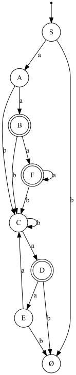
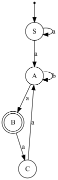
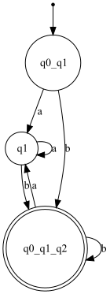

# Lab Report: Finite Automata and Grammar Classification

## Objectives

This lab's primary objectives were to deepen our understanding of finite automata (FAs) and explore their practical applications, particularly in the context of grammar classification and conversion between different automata types. Specifically, we aimed to:

1. Understand what an automaton is and what it can be used for.
2. Implement a function in the `Grammar` class to classify grammars based on the Chomsky hierarchy.
3. Convert a finite automaton to a regular grammar.
4. Determine whether a finite automaton is deterministic or non-deterministic.
5. Convert a non-deterministic finite automaton (NDFA) to a deterministic finite automaton (DFA).
6. Optionally, represent the finite automaton graphically using external libraries or tools.

## Implementation Overview

### `Grammar` Class

The `Grammar` class is central to our exploration of grammar classification. It represents a context-free grammar with capabilities to classify itself based on the Chomsky hierarchy.

```java
public class Grammar {
    private final List<Character> Vn;
    private final List<Character> Vt;
    private final Map<Character, List<String>> productions;
    private final char S;

    public Grammar(List<Character> Vn, List<Character> Vt,
                   Map<Character, List<String>> productions, char S) {
        this.Vn = Vn;
        this.Vt = Vt;
        this.productions = productions;
        this.S = S;
    }
}
```
Grammar Classification
We implemented the classifyGrammar method to analyze the grammar's productions and classify it accordingly.
```java
public String classifyGrammar() {
    // Logic to determine grammar type based on productions
}
```

## Determining the Type of Grammar by Chomsky Hierarchy

One of the pivotal tasks in this lab was to implement a function within the `Grammar` class that could classify a given grammar based on the Chomsky hierarchy. This hierarchy divides grammars into four types, each with distinct characteristics that determine the complexity and context of the languages they can generate. Understanding and classifying grammars according to this hierarchy is fundamental in theoretical computer science and linguistics.

### The Chomsky Hierarchy

The Chomsky hierarchy categorizes grammars into the following types:

- **Type 0 (Unrestricted Grammar):** These grammars have no restrictions on their production rules. They are the most general and can generate any language that a Turing machine can recognize.
- **Type 1 (Context-Sensitive Grammar):** In these grammars, the productions must not shorten the length of the string. Each production rule must be of the form \(\alpha A \beta \rightarrow \alpha \gamma \beta\), where \(A\) is a non-terminal and \(\alpha\), \(\beta\), and \(\gamma\) are strings of terminals and non-terminals.
- **Type 2 (Context-Free Grammar):** Productions in these grammars can have a single non-terminal on the left-hand side and a string of terminals and non-terminals on the right-hand side. They are powerful enough to describe most programming languages.
- **Type 3 (Regular Grammar):** These are the most restrictive grammars, where productions can either have a single terminal possibly followed by a non-terminal on the right-hand side or a single terminal on the right-hand side. They are equivalent to regular expressions and can be recognized by finite automata.

### Implementation of Grammar Classification

To classify grammars according to the Chomsky hierarchy, we developed the `classifyGrammar` method. This method analyzes the grammar's production rules to determine which category of the Chomsky hierarchy the grammar falls into based on the characteristics mentioned above.

#### Key Aspects of the Implementation:

- **Regular Grammar Check:** We inspected each production rule to ensure it adhered to the format allowed by regular grammars. This included checking for productions that either transition to another state with a terminal or end with a terminal.

    ```java
    if (!production.matches("[a-z]*[A-Z]?") && !production.equals("ε")) {
        isType3 = false;
    }
    ```

- **Context-Free Grammar Check:** The method verified that the left-hand side of each production contained only a single non-terminal, which is a hallmark of context-free grammars.

    ```java
    if (!production.matches("[a-zA-Zε]*")) {
        isType2 = false;
    }
    ```

### Finite Automata Classes
We developed two classes, DFiniteAutomaton and NDFiniteAutomaton, to represent deterministic and non-deterministic finite automata, respectively.

`DFiniteAutomaton` Class 

This class models deterministic finite automata (DFA). It includes functionalities for adding states, defining transitions, and checking string acceptance.
```java
public class DFiniteAutomaton implements FiniteAutomation {
    // Implementation details
}
```
`NDFiniteAutomaton` Class

The NDFiniteAutomaton class extends the capabilities of DFiniteAutomaton to support non-deterministic behaviors, including ε-transitions.
```java
public class NDFiniteAutomaton implements FiniteAutomation {
    // Extended implementation details for NDFAs
}
```
### Conversion and Classification
A key task was converting an NDFA to a DFA, for which we implemented the convertToDFA method, and classifying grammars using the classifyGrammar method in the Grammar class.

### Graphical Representation (Optional)
Optionally, we explored graphical representation of finite automata, leveraging libraries like Graphviz for visualization.

## Examples and Code Snippets
### Classifying a Context-Free Grammar
Here's an example of classifying a context-free grammar using the classifyGrammar method:
```java
Grammar cfg = new Grammar(
    List.of('S'), // Non-terminals
    List.of('a', 'b'), // Terminals
    Map.of('S', List.of("aS", "b")), // Productions
    'S' // Start symbol
);
System.out.println(cfg.classifyGrammar()); // Expected output: "Type 2 (Context-Free)"
```
### Converting an NDFA to a DFA
We demonstrated the conversion of an NDFA to a DFA using the convertToDFA method:
```java
NDFiniteAutomaton ndfa = new NDFiniteAutomaton(Set.of('a', 'b'));
// Configuration of NDFA states and transitions
DFiniteAutomaton dfa = ndfa.convertToDFA();
```
### Graphical Representation of an FA

Assuming a method generateGraph for graphical representation:
```java
DFiniteAutomaton dfa = new DFiniteAutomaton(Set.of('0', '1'));
// Configuration of DFA
dfa.generateGraph("dfa_visualization.png");
```
## DFA Representation
We used Graphviz to generate a graphical representation of a DFA, providing a visual depiction of states and transitions.
Moreover, we used the technic of represented empty set by the symbol ε.



## NFA Representation
We also visualized an NFA using Graphviz, showcasing the states and transitions in a graphical format.



## e-closure NFA to DFA Conversion
We implemented the e-closure method to calculate the ε-closure of a given set of states in an NFA. This method is crucial for the conversion of an NFA to a DFA.




## Detailed Conversion Process

### From NDFA to DFA

The conversion of a non-deterministic finite automaton (NDFA) to a deterministic finite automaton (DFA) is a crucial process that illustrates the theoretical underpinnings of automata theory in practice. This section elaborates on how we approached and implemented this conversion, highlighting the key steps and logic involved.

#### Understanding the Concept

The core challenge in converting an NDFA to a DFA lies in the non-determinism of NDFAs, where a single state can have multiple transitions for the same input symbol, including ε-transitions (transitions that do not consume any input). The goal is to transform this into a deterministic framework where each state has exactly one transition per input symbol.

#### The Conversion Algorithm

The conversion algorithm we implemented follows the subset construction method, which systematically constructs DFA states as sets of NDFA states. Here's a high-level overview of the steps involved:

1. **Epsilon Closure Computation:** For each NDFA state, we first computed the ε-closure, which is the set of states reachable from a given state through any number of ε-transitions, including the state itself.

    ```java
    private Set<String> calculateEpsilonClosure(String startState) {
        // Recursive method to compute ε-closure
    }
    ```

2. **Initial DFA State:** The initial DFA state is created as the ε-closure of the NDFA's start state. This ensures that all states reachable via ε-transitions from the start state are included.

3. **State Exploration:** We iteratively explored each newly created DFA state (a set of NDFA states) to determine its transitions based on the input symbols of the NDFA. For each input symbol, we identified the set of all possible next states across the included NDFA states and their ε-closures. Each unique set of next states formed a new DFA state.

    ```java
    public DFiniteAutomaton convertEpsilonNfaToDfa() {
        // Implementation details including state exploration and DFA state creation
    }
    ```

4. **Deterministic Transitions:** For each identified transition in the DFA, we ensured that it uniquely mapped from the current DFA state to a new DFA state for each input symbol, thereby achieving determinism.

5. **Accept States Identification:** A DFA state was marked as an accept state if any of its constituent NDFA states were accept states.

#### Implementation Highlights

- **State Encoding:** To manage DFA states effectively, we encoded sets of NDFA states into unique string identifiers. This encoding facilitated easy tracking of explored and unexplored states during the conversion process.

    ```java
    private String encodeState(Set<String> stateSet) {
        // Method to encode state sets into unique identifiers
    }
    ```

- **Handling Epsilon Transitions:** The computation of ε-closures was a critical step, ensuring that all possible state transitions, including those enabled by ε-transitions, were accurately represented in the resulting DFA.

#### Challenges and Solutions

- **Complexity Management:** The subset construction method can lead to an exponential increase in the number of states in the resulting DFA. We addressed this by efficiently encoding state sets and employing data structures that facilitated quick lookups and comparisons.

- **Ensuring Completeness:** To ensure the completeness of the DFA, where each state has a transition for every input symbol, we meticulously computed the transitions for each possible input symbol from each DFA state, creating new states as necessary.

### Conclusion
Through implementing and exploring these functionalities, we gained a comprehensive understanding of finite automata, their classifications, and conversions between different types. The optional graphical representation provided visual insights, further enriching our learning experience in automata theory and its applications in computer science.