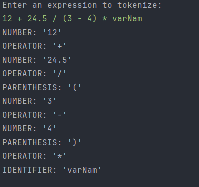

# Lexer Implementation in Java Lab Report

## Introduction

In this lab, we focused on constructing a lexer, which is a critical component in the process of lexical analysis, an essential step in parsing and compiling programming languages. The lexer, also known as a tokenizer or scanner, converts a sequence of input characters into a series of tokens, based on the syntax rules of the language.

## Objectives

- Understand the concept and importance of lexical analysis.
- Explore the internal workings of a lexer.
- Implement a lexer in Java that can efficiently tokenize a string into different types of tokens.

## Methodology

The implementation involved creating a Java application that consisted of:

- A `Type` enumeration to define the various types of tokens.
- A `Token` class to represent the tokens generated by the lexer.
- A `Lexer` class that performs the actual tokenization process, converting an input string into a series of tokens.

## Lexer Implementation Overview

The lexer was structured into several key components:

- **Type Enum**: Enumerated the possible token types, including `NUMBER`, `OPERATOR`, `IDENTIFIER`, and `PARENTHESIS`.
- **Token Class**: Represented a token with a specified type and text.
- **Lexer Class**: Processed the input string to convert it into tokens, distinguishing between different characters and sequences by assigning them to the appropriate token types.

The lexer's processing involved analyzing the input text character by character, identifying numbers, operators, identifiers, and parentheses, and omitting whitespace, while unexpected characters triggered exceptions.

## How the Lexer Works

The lexer operates by scanning the input string character by character and grouping these characters into tokens, which are the basic meaningful units for the programming language's syntax. The process follows these steps:

1. **Initialization**: The lexer starts with an input string and initializes a position indicator to keep track of its place in the string.

2. **Character Analysis**: As it reads the input, the lexer determines the category of each character (e.g., digit, letter, operator symbol) and uses this information to form tokens.

    - **Number Tokenization**: When a digit is encountered, the lexer continues to read and accumulate subsequent digits (and possibly a decimal point) to form a complete numeric literal, which becomes a `NUMBER` token.

    - **Identifier Tokenization**: If the lexer finds a letter, it assumes the start of an identifier (like a variable or function name) and accumulates subsequent letters or digits to form the whole identifier, resulting in an `IDENTIFIER` token.

    - **Operator Tokenization**: Encountering an operator symbol triggers the lexer to create an `OPERATOR` token with the symbol as its value.

    - **Parenthesis Handling**: When the lexer comes across a parenthesis, it generates a `PARENTHESIS` token, distinguishing between the opening and closing parentheses in the language's syntax.

3. **Whitespace and Separation**: The lexer skips whitespace since it's not significant for tokenization, serving only to separate tokens in the input.

4. **Error Handling**: If the lexer encounters an unexpected character that doesn't fit into any of the defined token categories, it throws an error, indicating that the input string contains invalid syntax according to the language rules.

5. **Token Collection**: As the lexer forms each token, it adds them to a list representing the tokenized output of the input string. This list is then used by the next phase of the language processing system, typically the parser.

By systematically categorizing the input string into a stream of tokens, the lexer lays the groundwork for the subsequent parsing stage, where the syntax structure of the program is analyzed and understood. This tokenization process is critical for compiling or interpreting code, as it converts raw text into structured data that the compiler or interpreter can manipulate.

## Results

Testing the lexer with a diverse string that included numbers, operators, identifiers, and parentheses demonstrated its capability to tokenize the input accurately, categorizing each piece of the string into the correct token type.

## Conclusion

This lab successfully led to the development of a functional lexer in Java, showcasing the essential role of lexical analysis in the process of understanding and processing programming languages. This hands-on experience underlined the significance of precise tokenization in the broader context of parsing and compiling processes.
